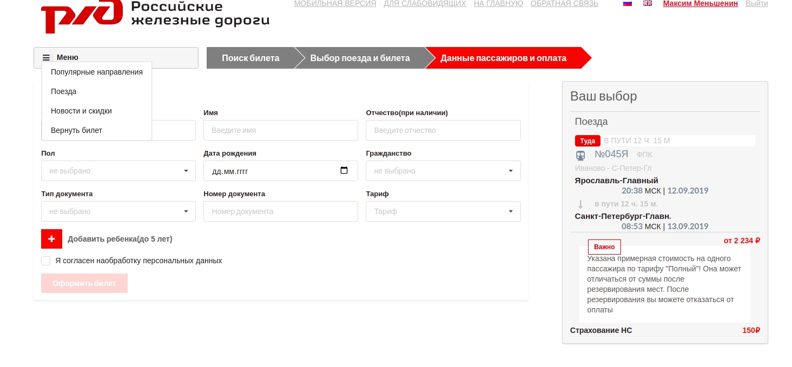
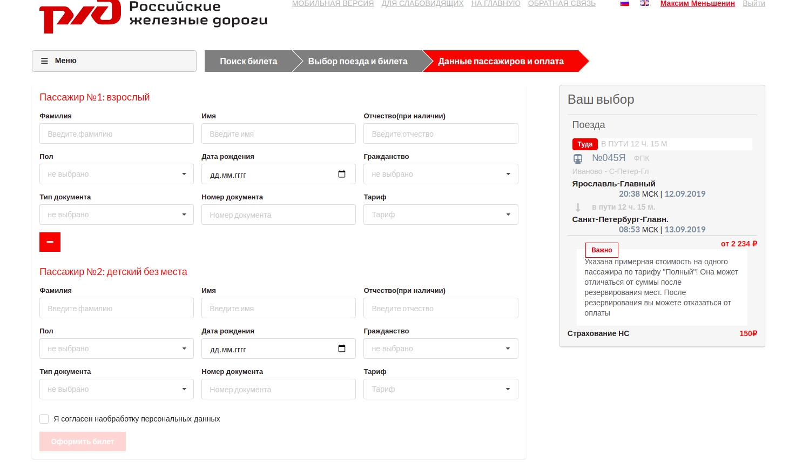
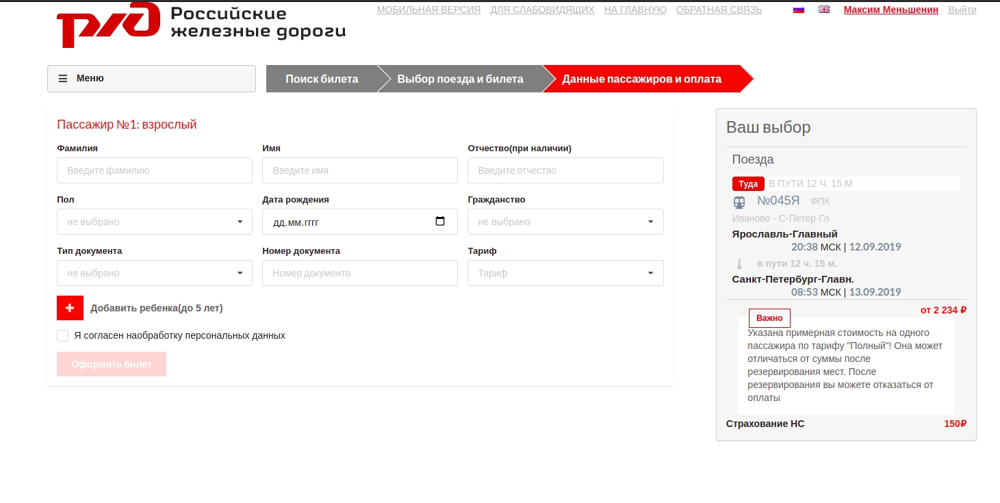
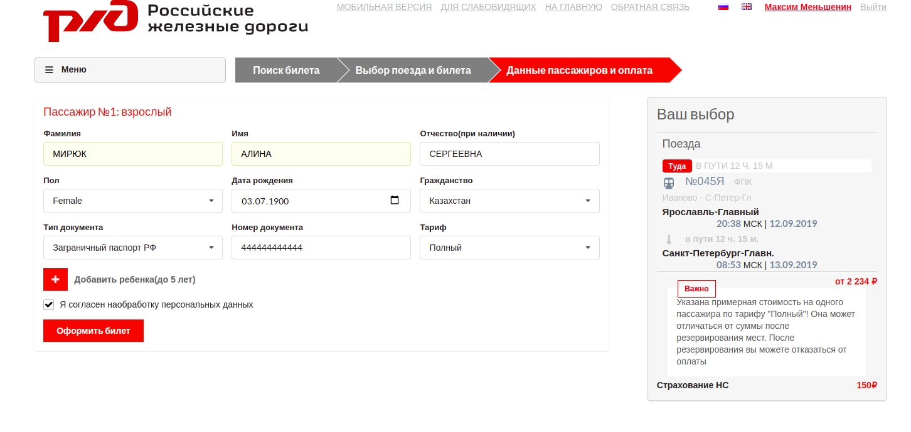
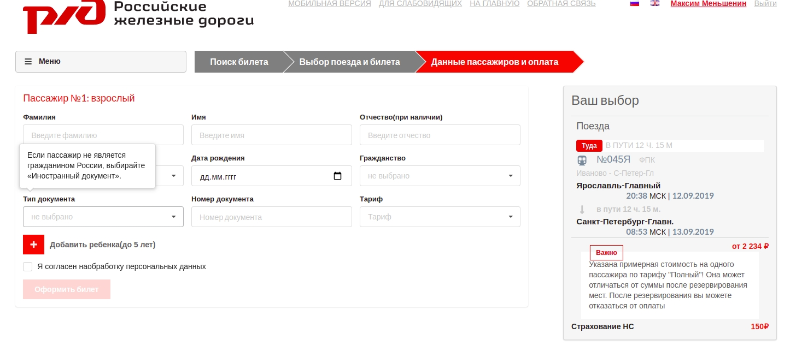

# RZD
A passenger's order form like on RZD website. 

## Stack
React, Redux, Redux-Thunk, CSS, Semantic UI

## Requirements:
* Use Semantic UI for your layout
* Some form's fields must be required, some not
* An oportunity to add or delete a passenger 
* Use https://webhook.site/ on submit to send form's data 

## How to start

```
cd frontend/

yarn install
yarn start
```

## Menu dropdown 


## A passenger can add child younger than 5 years old for free


## An order button is disabled while there are any unfilled inputs  



## Some fields are having a popup  

